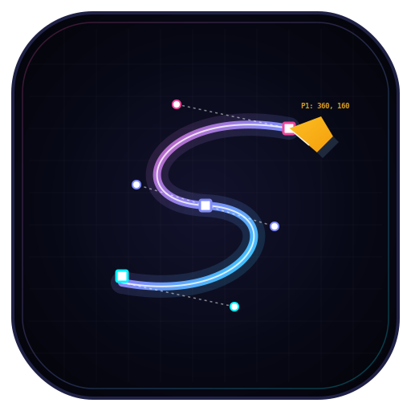
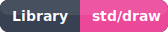
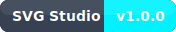
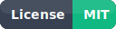

<p align="center">
  
</p>

<h1 align="center">Sesi SVG Studio</h1>

<p align="center">
  
  
  
  
</p>

A workspace for drawing and exporting SVGs using the [Sesi](https://github.com/misterscan/sesi) programming language and its built-in `std/draw` library.

Includes **Sesi SVG Studio** — a local web app for writing, previewing, and exporting Sesi drawing scripts interactively in the browser.

---

## Getting Started

### Prerequisites

- [Node.js](https://nodejs.org) v18+
- Dependencies installed:

```bash
npm install
```

---

## Sesi SVG Studio

An interactive browser-based editor for writing Sesi drawing code and previewing the resulting SVG in real time.

### Launch the Studio

```bash
npm run web
```

### Features

| Feature           | Description                                                                       |
| ----------------- | --------------------------------------------------------------------------------- |
| **Code Editor**   | Write Sesi drawing code with synced line numbers                                  |
| **Presets**       | 4 built-in demos: Neon Waves, Synthwave Sunset, Golden Mandala, Pulsing Star Core |
| **Canvas Size**   | Configurable width and height (px)                                                |
| **Live Preview**  | Renders SVG output directly in the browser                                        |
| **Zoom Controls** | Zoom in, zoom out, and reset the viewport                                         |
| **Copy SVG**      | Copies the raw SVG XML to your clipboard                                          |
| **Download**      | Saves the rendered SVG as a `.svg` file                                           |
| **Console**       | Displays script stdout and runtime errors                                         |

### How It Works

When you click **Render Drawing**, the browser sends your Sesi code to the local server (`ui.sesi`). The server writes it to a temporary file, runs it via `exec()`, captures the SVG output from stdout, and streams it back to the browser for display.

---

## Running Scripts Directly

To run any `.sesi` script from the command line:

```bash
npm run sesi <file>.sesi
```

For scripts that use external libraries, file I/O or `exec()` (like the Web server):

```bash
npm run local <file>.sesi
```

Inline code evaluation (useful for quick syntax checks):

```bash
npm run eval "print 'Hello from Sesi'"
```

---

## Drawing with `std/draw`

The `std/draw` module provides a full SVG drawing API. Import it at the top of any script:

```sesi
allow "std/draw" in with Draw
```

### Core Primitives

```sesi
Draw.rect(x, y, width, height, fill, options?)
Draw.circle(cx, cy, radius, fill, options?)
Draw.line(x1, y1, x2, y2, stroke, options?)
Draw.ellipse(cx, cy, rx, ry, fill, options?)
Draw.polygon("x1,y1 x2,y2 ...", fill, options?)
Draw.path(d, fill, options?)
Draw.text(x, y, content, fontSize, fill, options?)
```

### Gradients

```sesi
Draw.gradient("linear", "myGrad", [
  {"offset": "0%", "color": "#6366f1"},
  {"offset": "100%", "color": "#ec4899"}
], {"x1": "0%", "y1": "0%", "x2": "100%", "y2": "0%"})

Draw.rect(0, 0, 800, 600, "url(#myGrad)")
```

### CSS Animations & Styles

```sesi
Draw.style("
  @keyframes spin { 100% { transform: rotate(360deg); } }
  .rotating { animation: spin 3s linear infinite; transform-origin: 400px 300px; }
")

Draw.circle(400, 300, 80, "#818cf8", {"class": "rotating"})
```

### Render / Save

```sesi
let svg = Draw.render(800, 600)     // returns SVG as a string
Draw.save_svg("output.svg", 800, 600) // writes SVG file to disk
Draw.clear()                         // resets the draw buffer
```

---

## Workspace Structure

```
/
├── ui.sesi               # Web UI server
├── assets/index.html     # Web UI frontend (served by the above)
├── main.sesi             # General entry point script
├── bin/                  # Sesi CLI executable
├── make/                 # Project specific scripts to generate SVGs
├── playground/svgs       # Output folder
├── helpers/              # Helper scripts for Sesi
├── getting-started/      # Sesi language documentation
├── GUIDE.md              # Full Sesi language reference
└── env.example           # Environment variable template
```

---

## Other Commands

| Command                  | Description               |
| ------------------------ | ------------------------- |
| `npm run eval "<code>"`  | Evaluate Sesi code inline |
| `npm run lint`           | Run the Sesi linter       |
| `npm run encrypt <file>` | Encrypt a `.sesi` file    |
| `npm run decrypt <file>` | Decrypt a `.sesi` file    |
